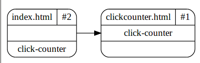

Polymer Element Dependencies
============================
`ped` is a package to inspect and document your polymer app element hierarchies.

## Installation
Add `ped` as a `dev_dependencies` in your project `pubspec.yaml` file.

## Usage
`ped` provides two public functions *toJson* and *toViz*. 
Each of them scans your polymer project (starting from a given *entry_point*) 
and creates a structure of imported components, polymer-element declarations 
and uses.

### toJson()
A JSON representation of the project structure, including

- imported HTML files
- polymer-element declarations
- element uses
- warnings for unused imports
- entry_point

### toViz()
The structure is output to a directed graph representation (dot-format) and 
included to the file `_ped.html` in the current directory. 

Viewing the file renders the dot-representation inside the browser.

*The package uses a version of `viz.js` 
[https://github.com/mdaines/viz.js](https://github.com/mdaines/viz.js) for 
rendering the directed graph in the browser.*

## Paths
Both *toJson* and *toViz* can be used with and without a filename / entry_point.

- **without an entry_point**: the filename is taken from the 
*transformer.polymer* entry_point value in *pubspec.yaml*. In this case the dart
script should be run from project root directory (same as the *pubspec.yaml* 
file).

- **with an entry_point**: render arbitrary polymer project hierarchies 
(see `test/toJson_test.dart`). 

## Example
See the `example` folder for a working example.
